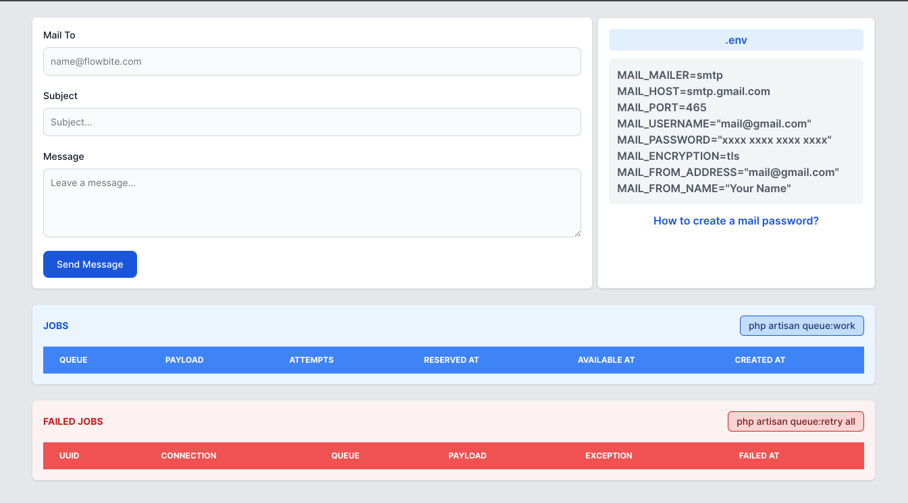

#Mastering Laravel 10 Mail with Jobs & Queues: 

## final refers the Website

https://medium.com/@bhuvaneshcj  clearly describe the step

## 1.ensure to create a new project and configure your .env file accordingly.

To initiate a new Laravel project, begin by launching Terminal and executing the following command:

composer create-project laravel/laravel mailqueue

## 2.Head over to the root directory of your project.

cd mailqueue

## 3.Adjust the queue driver and set up your mail configuration as per your requirements.

DB_CONNECTION=mysql

DB_HOST=127.0.0.1

DB_PORT=3306

DB_DATABASE=<YOUR DATABASE NAME>

DB_USERNAME=<YOUR DATABASE USERNAME>

DB_PASSWORD=<YOUR DATABASE PASSWORD>

QUEUE_CONNECTION=database

MAIL_MAILER=smtp

MAIL_HOST=smtp.gmail.com

MAIL_PORT=465

MAIL_USERNAME="mail@gmail.com"

MAIL_PASSWORD="xxxx xxxx xxxx xxxx"

MAIL_ENCRYPTION=tls

MAIL_FROM_ADDRESS="mail@gmail.com"

MAIL_FROM_NAME="Your Name"

 ## 4. To generate a password for mail usage, follow these steps:
 . Sign in to your Gmail account at myaccount.google.com.
 
 .  Navigate to the Security settings and enable Two-Factor Authentication.
 
 . Once Two-Factor Authentication is enabled, locate the “App passwords” option. Click here
 
 .  Select “Other” from the list of apps and enter your app’s name.
 
 .  Click on the “GENERATE” button to obtain a new app password.
 
 . Copy the 16-digit password provided and click “Done”.
 
 . Utilize this generated password instead of your regular email password for sending emails via your application.
 
## 5.Execute the following command to generate migrations and create tables for a queue:

php artisan queue:table

 ## 6.This command will create a migration file for the queue tables. After generating the migration, you can run the migration to create the necessary tables in the database. Use the following command to run the migration:

php artisan migrate

 ## 7.Create a Mail Class
 
To create a new mail class for sending emails in Laravel, you can use the make:mail Artisan command. Here's how you can do it:

php artisan make:mail NewMail

This command will generate a new mail class in the App\Mail directory.

Once the mail class is generated, you can customize it according to your needs. Open the generated mail class file located at app/Mail/NewMail.php

<?php

namespace App\Mail;

use Illuminate\Bus\Queueable;

use Illuminate\Mail\Mailable;

use Illuminate\Mail\Mailables\Content;

use Illuminate\Mail\Mailables\Envelope;

use Illuminate\Queue\SerializesModels;

class NewMail extends Mailable
{
    use Queueable, SerializesModels;

    public $mailData;

    /**
     * Create a new message instance.
     */
    public function __construct($mailData)
    {
        $this->mailData = $mailData;
    }

    /**
     * Get the message envelope.
     */
    public function envelope(): Envelope
    {
        return new Envelope(
        
            subject: $this->mailData['subject'],
        );
    }

    /**
     * Get the message content definition.
     */
    public function content(): Content
    {
        return new Content(
        
            view: 'emails.new-mail',
        );
    }

    /**
     * Get the attachments for the message.
     *
     * @return array<int, \Illuminate\Mail\Mailables\Attachment>
     */
    public function attachments(): array
    {
        return [];
    }
}
## 8.To create a view file for the mail class in Laravel, you can use the following steps:

Navigate to the resources/views/emails directory in your Laravel project. If the emails directory does not exist, you can create it.

Inside the emails directory, create a new blade template file. You can name it whatever you like, for example, new-mail.blade.php.

<!DOCTYPE html>
<html lang="en">

<head>
    <meta charset="UTF-8">
    <meta name="viewport" content="width=device-width, initial-scale=1.0">
    <title>Laravel Queue & Jobs</title>
</head>

<body>
    
Dear Sir/Madam,

    
{{$mailData['message']}}

    
Thank you

</body>

</html>

## 9.Create a Job Class

To create a new job class for sending emails in Laravel, you can use the make:job Artisan command. Here's how you can do it:

php artisan make:job SendMail

This command will generate a new job class in the App\Jobs directory.

Once the job class is generated, you can customize it according to your needs. Open the generated job class file located at app/Jobs/SendMail.php

<?php

namespace App\Jobs;

use App\Mail\NewMail;

use Illuminate\Bus\Queueable;

use Illuminate\Contracts\Queue\ShouldQueue;

use Illuminate\Foundation\Bus\Dispatchable;

use Illuminate\Queue\InteractsWithQueue;

use Illuminate\Queue\SerializesModels;

use Mail;

class SendMail implements ShouldQueue
{
    use Dispatchable, InteractsWithQueue, Queueable, SerializesModels;

    public $data;

    /**
     * Create a new job instance.
     */
    public function __construct($data)
    {
        $this->data = $data;
    }

    /**
     * Execute the job.
     */
    public function handle(): void
    {
        Mail::to($this->data['mail_to'])->send(new NewMail([
            'subject' => $this->data['subject'],
            'message' => $this->data['message'],
        ]));
    }
}
## 10.Create a Mail Controller

To create a mail controller in Laravel, you can use the make:controller Artisan command. Here's how you can do it:

php artisan make:controller MailController

This command will generate a new controller class named MailController in the App\Http\Controllers directory.

Once the controller is generated, you can customize it according to your needs. Open the generated controller file located at app/Http/Controllers/MailController.php

<?php

namespace App\Http\Controllers;

use App\Jobs\SendMail;

use Illuminate\Http\Request;

use Illuminate\Support\Facades\DB;

class MailController extends Controller
{
    public function index()
    {
        $jobs = DB::table('jobs')->get();
        $failedJobs = DB::table('failed_jobs')->get();

        return view('welcome', compact('jobs', 'failedJobs'));
    }

    public function sendMail(Request $request)
    {
        $request->validate([
            'mail_to' => 'required',
            'subject' => 'required',
            'message' => 'required',
        ]);

        $dispatchData = [
            'mail_to' => $request->mail_to,
            'subject' => $request->subject,
            'message' => $request->message,
        ];

        SendMail::dispatch($dispatchData);

        toastr()->success('Mail sent successfully');
        return redirect('/');
    }
}
## 11.Modify the Web Routes

To modify the web routes in Laravel to include routes for sending emails using the MailController, you can do the following:

Open the routes/web.php file located in your Laravel project.

Define a route to access the sendEmail method of the MailController.

Here’s an example of how you can define the route:

<?php

use App\Http\Controllers\MailController;
use Illuminate\Support\Facades\Route;

/*
|--------------------------------------------------------------------------
| Web Routes
|--------------------------------------------------------------------------
|
| Here is where you can register web routes for your application. These
| routes are loaded by the RouteServiceProvider and all of them will
| be assigned to the "web" middleware group. Make something great!
|
 */

Route::get('/', [MailController::class, 'index']);

Route::post('send-mail', [MailController::class, 'sendMail']);

## 12. Custome the Welcome blade file

Open the resources/views/welcome.blade.php file in your Laravel project. If this file doesn't exist, you can create it.

<!DOCTYPE html>
<html lang="en">

<head>
    <meta charset="UTF-8">
    <meta name="viewport" content="width=device-width, initial-scale=1.0">
    <title>Laravel Queue & Jobs</title>
    <link href="https://cdnjs.cloudflare.com/ajax/libs/flowbite/2.3.0/flowbite.min.css" rel="stylesheet" />
</head>

<body class="bg-gray-200">

    

        

            

                <form action="{{url('send-mail')}}" method="post">
                    @csrf
                    

                        <label class="block mb-2 text-sm font-medium text-gray-900" for="email">Mail To</label>
                        <input
                            class="bg-gray-50 border border-gray-300 text-gray-900 text-sm rounded-lg focus:ring-blue-500 focus:border-blue-500 block w-full p-2.5"
                            id="email" placeholder="name@flowbite.com" type="email" name="mail_to" />
                        @error('mail_to')<small class="text-red-600 font-medium">{{$message}}</small>@enderror
                    

                    

                        <label class="block mb-2 text-sm font-medium text-gray-900" for="subject">Subject</label>
                        <input
                            class="bg-gray-50 border border-gray-300 text-gray-900 text-sm rounded-lg focus:ring-blue-500 focus:border-blue-500 block w-full p-2.5"
                            id="subject" placeholder="Subject..." type="text" name="subject" />
                        @error('subject')<small class="text-red-600 font-medium">{{$message}}</small>@enderror
                    

                    

                        <label for="message" class="block mb-2 text-sm font-medium text-gray-900">Message</label>
                        <textarea
                            class="block p-2.5 w-full text-sm text-gray-900 bg-gray-50 rounded-lg border border-gray-300 focus:ring-blue-500 focus:border-blue-500"
                            id="message" rows="4" placeholder="Leave a message..." name="message"></textarea>
                        @error('message')<small class="text-red-600 font-medium">{{$message}}</small>@enderror
                    

                    <button type="submit"
                        class="text-white bg-blue-700 hover:bg-blue-800 focus:ring-4 focus:outline-none focus:ring-blue-300 font-medium rounded-lg text-sm w-full sm:w-auto px-5 py-2.5 text-center">
                        Send Message
                    </button>
                </form>
            

            

                

                    .env
                

                

                    MAIL_MAILER=smtp 
                    MAIL_HOST=smtp.gmail.com 
                    MAIL_PORT=465 
                    MAIL_USERNAME="mail@gmail.com" 
                    MAIL_PASSWORD="xxxx xxxx xxxx xxxx" 
                    MAIL_ENCRYPTION=tls 
                    MAIL_FROM_ADDRESS="mail@gmail.com" 
                    MAIL_FROM_NAME="Your Name" 
                

                

                    <button class="text-blue-700 font-semibold" data-modal-target="mail-password-modal"
                        data-modal-toggle="mail-password-modal" type="button">
                        How to create a mail password?
                    </button>
                

                

                    

                        

                            

                                <ul class="text-gray-700">
                                    <li class="border-b py-2">
                                        Login to your gmail account e.g. myaccount.google.com
                                    </li>
                                    <li class="border-b py-2">
                                        Go to Security setting and Enable 2 factor (step) authentication
                                    </li>
                                    <li class="border-b py-2">
                                        After enabling this you can see app passwords option. Click
                                        <a class="text-blue-700 font-medium underline"
                                            href="https://myaccount.google.com/apppasswords" target="_blank">
                                            here</a>.
                                    </li>
                                    <li class="border-b py-2">
                                        And then, from Your app passwords tab select Other option and put your app
                                        name and click GENERATE button to get new app password.
                                    </li>
                                    <li>
                                        Finally copy the 16 digit of password and click done. Now use this password
                                        instead of email
                                        password to send mail via your app.
                                    </li>
                                </ul>
                            

                            

                                <button data-modal-hide="mail-password-modal" type="button"
                                    class="py-2.5 px-5 ms-3 text-sm font-medium text-gray-900 focus:outline-none bg-white rounded-lg border border-gray-200 hover:bg-gray-100 hover:text-blue-700 focus:z-10 focus:ring-4 focus:ring-gray-100">Close</button>
                            

                        

                    

                

            

        

        

            

                

                    Jobs
                

                

                    php artisan queue:work
                

            

            

                <table class="w-full text-sm text-left rtl:text-right text-gray-500">
                    <thead class="text-xs text-white uppercase bg-blue-500">
                        <tr>
                            <th scope="col" class="px-6 py-3">
                                Queue
                            </th>
                            <th scope="col" class="px-6 py-3">
                                Payload
                            </th>
                            <th scope="col" class="px-6 py-3">
                                Attempts
                            </th>
                            <th scope="col" class="px-6 py-3">
                                Reserved At
                            </th>
                            <th scope="col" class="px-6 py-3">
                                Available At
                            </th>
                            <th scope="col" class="px-6 py-3">
                                Created At
                            </th>
                        </tr>
                    </thead>
                    <tbody>
                        @foreach($jobs as $job)
                        <tr class="bg-white border-b">
                            <td class="px-6 py-4">{{$job->queue}}</td>
                            <td class="px-6 py-4">{{$job->payload}}</td>
                            <td class="px-6 py-4">{{$job->attempts}}</td>
                            <td class="px-6 py-4">{{$job->reserved_at}}</td>
                            <td class="px-6 py-4">{{$job->available_at}}</td>
                            <td class="px-6 py-4">{{$job->created_at}}</td>
                        </tr>
                        @endforeach
                    </tbody>
                </table>
            

        

        

            

                

                    Failed Jobs
                

                

                    php artisan queue:retry all
                

            

            

                <table class="w-full text-sm text-left rtl:text-right text-gray-500">
                    <thead class="text-xs text-white uppercase bg-red-500">
                        <tr>
                            <th scope="col" class="px-6 py-3">
                                UUID
                            </th>
                            <th scope="col" class="px-6 py-3">
                                Connection
                            </th>
                            <th scope="col" class="px-6 py-3">
                                Queue
                            </th>
                            <th scope="col" class="px-6 py-3">
                                Payload
                            </th>
                            <th scope="col" class="px-6 py-3">
                                Exception
                            </th>
                            <th scope="col" class="px-6 py-3">
                                Failed At
                            </th>
                        </tr>
                    </thead>
                    <tbody>
                        @foreach($failedJobs as $failedJob)
                        <tr class="bg-white border-b">
                            <td class="px-6 py-4">{{$failedJob->uuid}}</td>
                            <td class="px-6 py-4">{{$failedJob->connection}}</td>
                            <td class="px-6 py-4">{{$failedJob->queue}}</td>
                            <td class="px-6 py-4">{{$failedJob->payload}}</td>
                            <td class="px-6 py-4">{{$failedJob->exception}}</td>
                            <td class="px-6 py-4">{{$failedJob->failed_at}}</td>
                        </tr>
                        @endforeach
                    </tbody>
                </table>
            

        

    

    
</body>

</html> 

## 13 .Install Toastr.js notifications for Laravel

Run the following command in your terminal to install Toastr via composer:

composer require yoeunes/toastr

## 14. Please launch your project using the following command php artisan serve and navigate to the following link:

http://localhost:8000

Once the email form submission, you’ll discover the corresponding task listed in the jobs table. To execute the task, utilize the provided commands as follows:

php artisan queue:work
In the event of a mail delivery failure, the associated job will be transferred to the failed_jobs table. To retry failed jobs, please execute the command provided below.

php artisan queue:retry-all
Thank you for joining me on this exploration of Laravel 10 Mail with Jobs and Queues. I hope this series has provided you with valuable insights and practical knowledge to enhance your email delivery workflows in Laravel applications.

If you’re eager to dive deeper or have any questions about the concepts covered, don’t hesitate to reach out. I’ve attached the source code link below for your reference. Feel free to explore, experiment, and adapt the examples to suit your specific needs.

Thank you again for your time and interest. Here’s to building amazing things with Laravel!

## Screenshot

